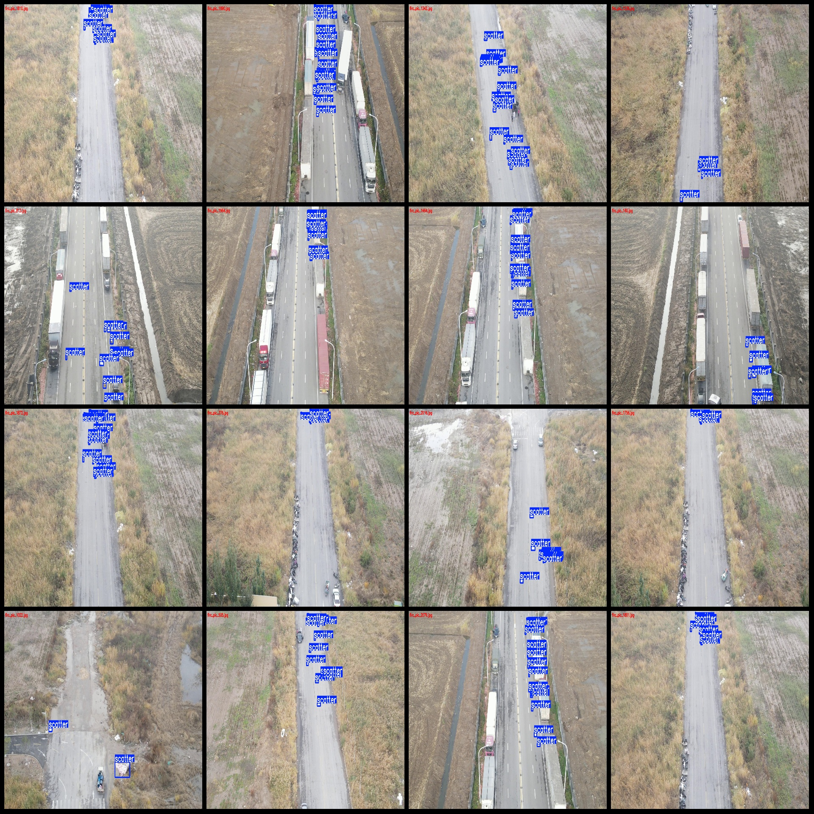
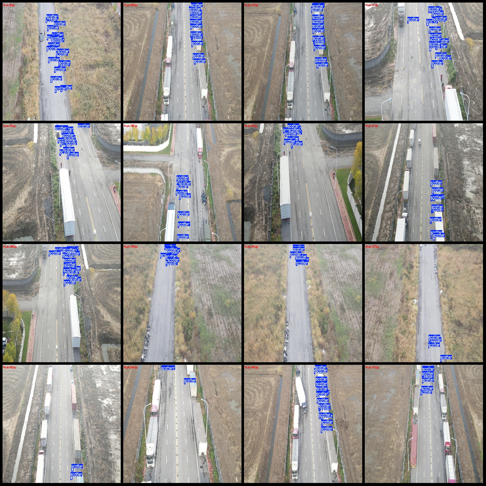
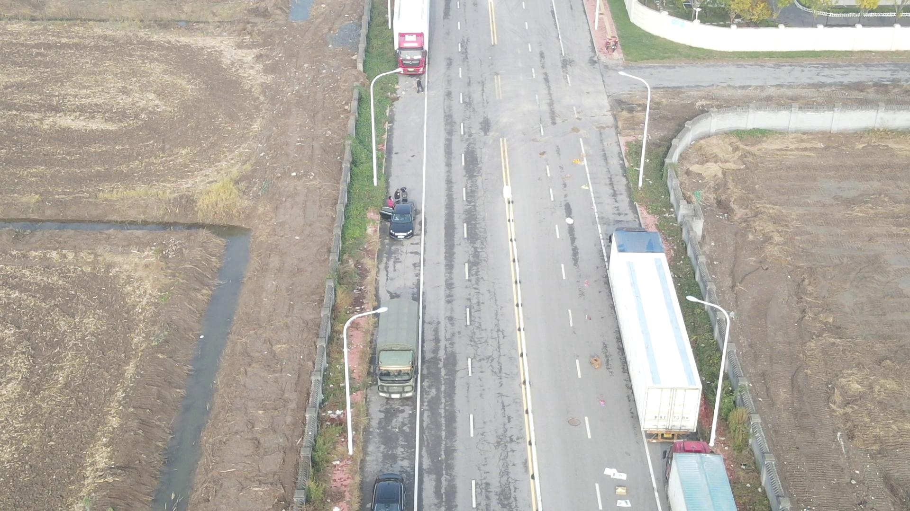

# Drone Perspective Aerial Photography Roadway Spillover Detection Dataset (VOC+YOLO) in 2133 Categories

Dataset format: Pascal VOC format + YOLO format (without split path txt files, only containing jpg images and corresponding VOC format xml files and YOLO format txt files)
Number of images (jpg file count): 2133
Number of annotations (xml file count): 2133
Number of annotations (txt file count): 2133
Number of categories: 1
Annotation category name: ["scatter"]
Number of bounding boxes per category: 
scatter bounding boxes = 25910
Total bounding boxes: 25910
Number of images per category: 
scatter images = 2133
Image resolution: 1920x1080
Annotation tool used: labelImg
Annotation rules: draw rectangular bounding boxes for the category
Important note: The dataset does not have been split into training, validation, or test sets. You need to manually divide them.
Special statement: This dataset does not guarantee the accuracy of the trained model or weight files.
Image preview: 
Annotation examples:

## Images

Here is a pay link on Stripe ( https://buy.stripe.com/3cs8yP7sY87d0vu9AB ). Please contact me lonlonago@foxmail.com after funding $89, and I will send you a complete data files , thank you!

